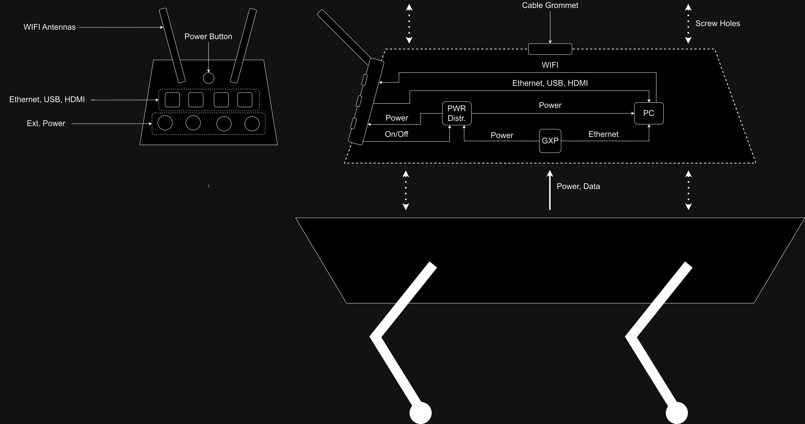

## Functional Overview

This section gives a functional overview of the system as shown in figure 1: 

    
     
    <em>Figure 1: Functional overview of the SPOT Backpack.</em>

In this diagram you can see that:
- The GXP provides power and data communication from SPOT 
- The power button bridges the power from the GXP to the power distribution
- Power is distributed via the power distribution (PWR Distr.) to the PC and to the interface panel
- The PC provides WIFI via 2 WIFI antennas
- The interface panel has various connectors that allow development with the on-board PC
- The top surface of the backpack inlcudes a cable grommet and an array of screw holes

For a more in-depth electrical diagram, please see the [implementation](/Documentation/07-Implementation.md) section.

Below you can see a 3D version of the Backpack in Solidworks (without any add-on components):

    
    
    
<i>Solidworks assembly of the SMART SPOT Backpack.</i>

***

In the next section you can read about the key quality attributes that the system should satisfy.

> ➡️ [Next: Quality Attributes](./03-quality-attributes.md)

> ⬅️ [Previous: Context](./01-context.md)

