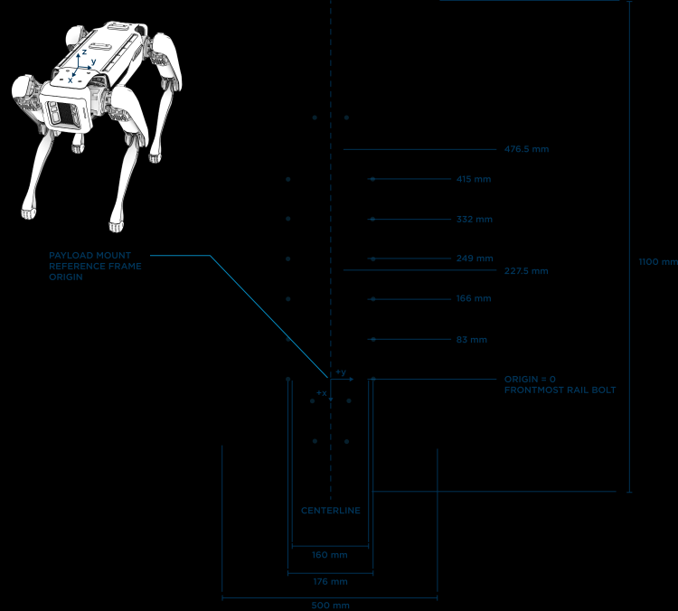
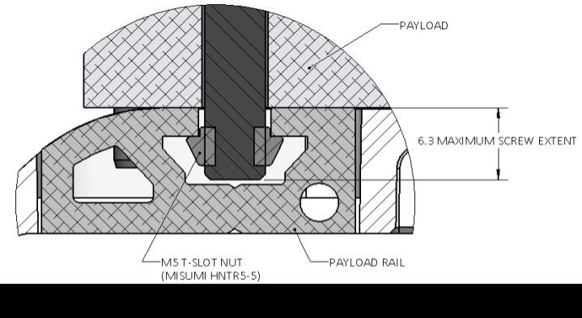
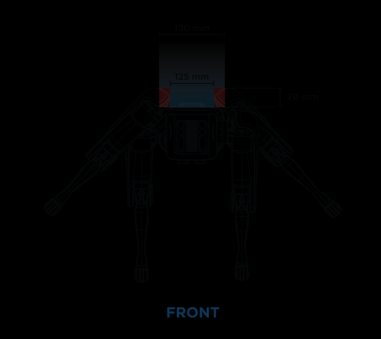
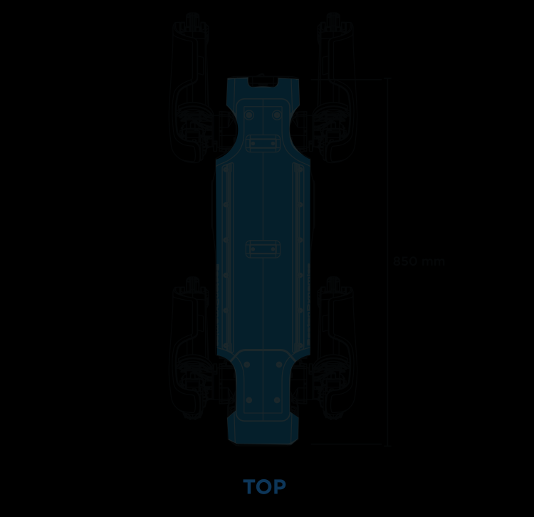

## Constraints

This section states the constraints that affect the design of the backpack. The constraints and images w.r.t to SPOT are taken from the [Payload Developer Guide](https://dev.bostondynamics.com/docs/payload/payload_configuration_requirements.html) by Boston Dynamics and where applicable, further elaborated on.

Constraints include: 
- Mounting Surface
- Weight
- Dimensions
- Electrical Power and Data Interface to SPOT
- Manufacturing Guidelines of Sheet Metal Parts 

## Mounting Surface
The only mounting surface that SPOT provides are aluminum rails that are located along the left and right edges of the body. The rails accept T-slot nuts such as Misumi HNTR5-5. Mounting screws should not project more than 6.3mm below the top surface of the mounting rail.

    
     
    <em>Aluminum rails for mounting.</em>

    
     
    <em>Mounting rail keying pin specifications in mm.</em>

## Payload Weight

SPOT has a maximum payload of 14.8 kg. Additionally, the weight of payload will also affect SPOT's battery consumption.
Furthermore, Spot can better handle payload mass if the combined center of mass lies between the front and rear hips. Spot will be more agile and less likely to fall if the total payload mass is centered on the middle of the robot.

## Payload Width
 
The maximum recommended width by Boston Dynamics for a body-mounted payload is 190mm. Wider payloads will result in reduced overall mobility and significant interference with the legs. 
For instance, SPOT's legs may shoot up when walking stairs or when self-righting.
One should thus avoid interference with the robot’s legs as shown below by avoiding the areas immediately adjacent to the robot’s hips.

    
     
    <em>Payload width constraint. Wider payloads may obstruct the leg movements of SPOT.</em>

## Payload Length
The payload should not overhang the front or rear of the robot as this will reduce maneuverability. For instance, when SPOT is standing in a corner or a narrow, it may not be able to turn around.

    
     
    <em>Payload length constraint. Wider payloads may obstruct the turning radius SPOT.</em>

## Payload Height

The height of the payload impacts the robot’s ability to self-right and increases the height of the center of mass. Therefore, the center of mass low should be kept as low as possible, as the robot may not self-right if the payload is too top-heavy.

## Electrical Power and Data Interface (General Expansion Payload (GXP))

The [General Expansion Payload (GXP)](https://support.bostondynamics.com/s/article/Spot-General-Expansion-Payload-GXP) provides power and data communication to SPOT. 
Specifically, it provides a maximum of 150W shared between 12V and 24V, and 5V at a maximum of 10W via a HD15 connector. The pin out can be found on the documentation site of the GXP. Data communication is provided via a RJ45 connector.
In addition to the electrical contstraints the GXP provides, it also exerts some mechanical contrstraints: 1), The GXP must fit inside the backpack and 2), the cable of the GXP must be connected to the payload connector on the top surface of SPOT, otherwise the [motors of SPOT will not start up](https://dev.bostondynamics.com/docs/payload/robot_electrical_interface).

## Sheet Metal Parts Manufacturing

Sheet metal parts have been manufatured via [247TailorSteel](https://www.247tailorsteel.com/en) which uses [SOPHIA](https://www.247tailorsteel.com/nl/sophia) as an online software tool for their manufaturing process. All sheet metal parts have to comply to their [manufacturing guidelines](https://www.247tailorsteel.com/en/service/submission-rules-and-guidelines), which include for example guidelines on cutting and bending of sheet metal parts.

