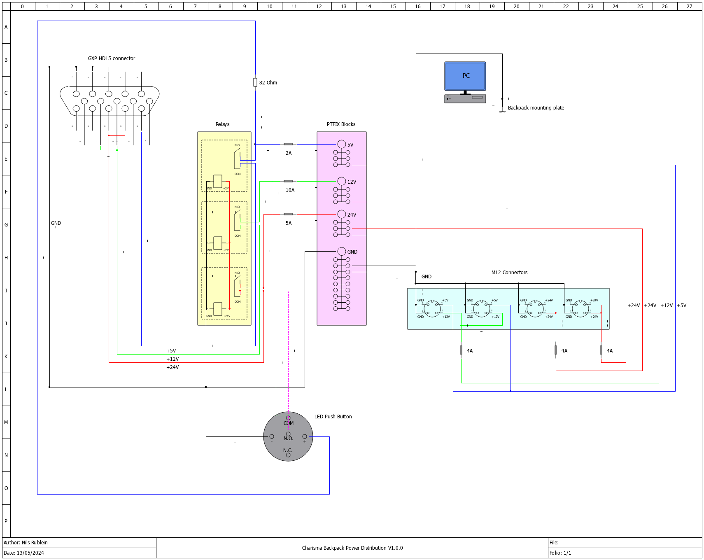

## Implementation

This section describes the implementation details of this system. For this hardware project it includes a list of parts and description of the power distribution.

### Bill of materials

You can find a bill of materials including costs and links to the respective products in `/Other Files`. Note that the list does not include tools and that some parts you may alrady have like the screws.

The total price is ... for these specific parts. 

### Power Distribution

You can find a diagram of the power distribution below:

    
     
    <em>Electrical diagram of the power distribution.</em>

This file has been created using [QElectrotech](), which is free and works both on Linux and Windows. The corresponding `.qet` file can be found in `/Other Files`.

In the figure above you can see the following:

The GXP provides power and ground (GND) line to an array of [HF105F-4](https://nl.rs-online.com/web/p/power-relays/1218075) relays. A full pinout of the GXP can be found [here](https://support.bostondynamics.com/s/article/Spot-General-Expansion-Payload-GXP). The GXP provides 
* 12V and 24V shared at 150W
* 5V at 10W

The relays run at 24V and switch the connection from the Common (COM) port to the Normaly Open (N.O.) port when the power button is pressed.
The 24V and the GND of the relays are connected in series for all three relays, which supply 24V, 12V and 5V respectively to a set of [PTFIX distribution blocks](https://www.phoenixcontact.com/en-pc/ptfix-distribution-blocks).

You can see a set of fuses (5A, 10A, 2A) between the relays and the PTFIX blocks. This is because we want to limit the power coming from the GXP to the power distribution for two reasons:

1) We do not know what kind of fuses are build into SPOT. If we draw too much power and a fuse breaks inside SPOT, we would have to wait for maintenance of Boston Dynamics. Therefore, we add our own fuses which we can easily replace ourselves.

2) If we draw too much power via external devices from the M12 connecors, there may be the chance that the PC does not get enough power and cuts out. In this case, the [Vecow 7000 SPC](https://www.vecow.com/dispPageBox/vecow/VecowCT.aspx?ddsPageID=PRODUCTDTL_EN&dbid=4739565050) uses between 17.7 and 33.5W depending on its CPU load. We  reserve thus (conservatively) 40W for the PC, by adding a 10A fuse to the 12V and a 5A fuse as the 24V line, as these lines share 150W. 

The amp ratings have been determined based on [this](https://peerlesselectronics.com/blog/choosing-right-fuse-for-your-needs.html) article:

**24V:** 

$110W / 24V = 4.6 A$ 

$4.6A * 1.25 = 5.75 A$

$(4.6A + 5.75A) / 2 ≈ 5 A$

**12V:** 

$110W / 12V = 9.2 A$

$9.2A * 1.25 = 11.5 A$

$(9.2A + 11.5A) / 2 ≈ 10 A$

**5V:**

$10W/2V = 2A$

$2A * 1.25 = 2.5A $

$(2A + 2.5A)/2 ≈ 2A$

Note that we use inline fuses due to space resctrictions of the backpack. If more space would be available, mounted fuses (e.g. by PTFIX) would be the prefered choice.

Next, you can see that the PC is connected to the 24V PTFIX distribution block. The Vecow SPC 7000 runs anywhere between 9-55V, you may choose to connect it to the 12V instead. Additionally, you can see that the PC is grounded to the mounting plate of the backpack.

Finally, you can see a set of M12 connectors that supply 5V, 12V and 24V to external devices. Here, the connectors on the left provide 5V and 12V while the connectors on teh right supply 24V. Note that the connectors on the left side have 4 poles and the connectors on the right have 5 poles. This is to avoid inserting a male M12 connector that should be connected to a 5V/12V connection, into a 24V connection. Finally, also here are fuses added at 4A, as the connectors are rated for 4A.

