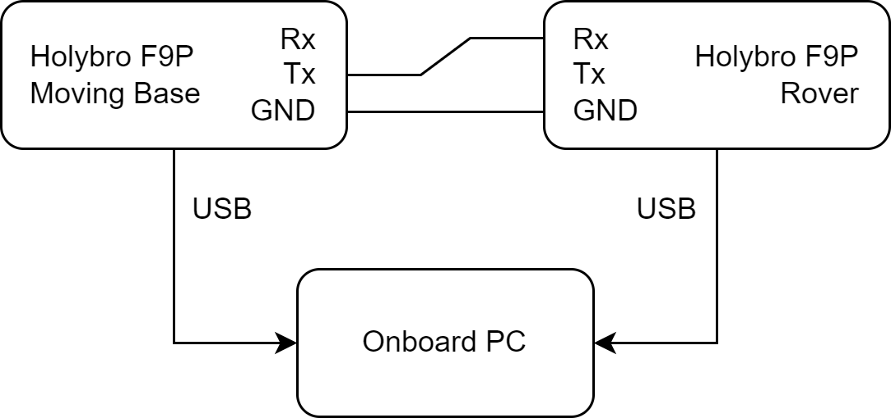

## Assembly Instructions

This section describes how to assemble the backpack.

### Step 1: Sheet metal and 3D printed parts

Create the sheet metal and 3D printed parts as described in section [XXX](/Documentation/xx-manufacturing-instructions.md).  

### Step 2: Insert rivets nuts 

Next, insert rivet nuts into the top holes of the outershell and the side bends of the mounting plate. You may need to hammer  the rivets into the holes, due to the low tolerance. Be careful with the side bends, it may be better to just file away a little of the aluminum than hammering in the rivets, as too much force may deform the bends.

Once you have inserted the rivets nuts into the holes, you will need to permanently insert them using a rivet tool. Be careful that you do not apply too much force as you may damage the threading of the rivets nuts.

    
    
    

    

        <em>Installing rivet nuts with a rivet tool.</em>
    

### Step 3: Assemble the panels

@TODO
* *FIND datasheet of pwr button!!!*
* *Would also be best to embed circuit diagrams in here as well*

Next, assemble as the panels as shown below. For each panel you will need 4x M3x10 screws to screw the panel onto the 3D printed bracket. For the interface panel, it's advised to start from the bottom up: First insert the M12 power connectors, then the media connectors (from left to right: Ethernet, 2x USB, HDMI) and then finally the power button and the female RP-SMA connectors for the WIFI antennas. For the media connectors, use 8x M3x12 screws.

    
     
    <em>Interface panel.</em>

***

### Step 4: Assemble power distribution
Next, assemble the power distribution. 
After you have printed the power distribution mount, you have to insert the heat set inserts using a soldering iron. 
Next, you will need a DIN rail of approximately 15 cm length. Screw the DIN rail into the heat inserts on top of the mount using 2x M3x8 screws with washers. 
Next, slide the PTFIX connectors onto the DIN rail and screw in the relays blocks as shown below.

    
    
    
    

    

        <em>Power Distribution mount.</em>
    

**CHECK FOR IMG WITH PTFIX BLOCKS**

**VGA connector**

Next, you will need to solder a VGA / HD15 connector for the GXP, you can find the pinout of the GXP [here](https://support.bostondynamics.com/s/article/Spot-General-Expansion-Payload-GXP).
For this custom connector you will need the following pins:

* GND: 1-4
* 5V: 15
* 12V: 7-8
* 24V: 13-14

Before soldering the wires to it, make sure they are at least 50 cm long.
Once you are done soldering, you can add a braided sleeve around the wires to organize them neatly.

    
    
    

    

        <em>Soldering custom HD15 connector for the GXP.</em>
    

***

**Mount panel, GXP and  power distribution block**

Next, mount the interface panel (the one with all the connectors), the GXP and the power distribution mount. 

Start with mounting the 3D printed bracket for interface panel by inserting 2x M3x10 screws from the bottom of the main mounting plate. Note that the left and rigt side of the mounting plate differ in length. Make sure to connect this panel to the longer side, as shown below.

    
    
    

    

        <em>Solidworks assembly of mounting plate and 3D printed interface bracket. Note how the right side of the mounting plate is longer than the other.</em>
    

Next, place the GXP onto the plate and mark its outline on the mounting plate. Afterwards, you can route the wires coming from the interface panel through the holes beneath the GXP. It's best to zip tie the wires to the mounting board.

    
    
    

    

        <em>Marking outline of the GXP in order to route the wires from the interface panel beneath the GXP.</em>
    

Next, mount the GXP to the main mounting plate using 2x M5x20 screws (use nuts at the bottom of the mounting plate). Make sure the ethernet and HD15 port face towards the interface panel. 
Take the cable from the GXP and lay it out to the left as shown below. Finally, you can mount the power distribution board with the relays facing the GXP. Here, use 4x M3x8 screws.

    
    
    

    

        <em>Mounting the GXP and then the power distribution mount.</em>
    

***

**Relays**

Next, we will connect the wires coming from the GXP to the the relays and the PTFIX connectors.

**INSERT ELECTRICAL DIAGRAM**

First we will take care of the power lines of the relays, which operate at 24V. Therefore, take both the 24V wires coming from the GXP and crimp them together with the N.O. connection of the power button (use a female spade connector).

    
     
    <em>Crimped wires of the 24V line of the GXP with the N.O. port of the power button.</em>

Insert this connector into the COM slot of the most of the right relay. Next, crimp the wire from the COM port of the power button and another red wire of approximately 6 cm lenght and connect it to the positive power connection of the same relay.
Then, we will continue the positive power line of the relays. Crimp together the loose red wire with another red wire and insert it into the middle relay. Finally, crimp the end of the just added wire together and insert it in into the last relay. 
Afterwards, crimp together 3 black wires such that you can connect the ends to all 3 ports of the negative power line for the relays as well as to the ground PTFIX block.

    
    
    

    

        <em>Crimped wires of the positive  and negative power lines of the relays.</em>
    

Next, take the 2 12V leads coming from the GXP, crimp them together and insert them into the COM port of the middle relay. Afterwards, take the 5V lead from the GXP and crimp it together with a female spade connector and insert it into the COM port of the last relay.

You can test at this point if the relay system works: connect the GXP to SPOT, power on SPOT and press the power button of the panel. You should read now 24V, 12V and 5V respectively at the N.O. ports of the relays; the LED of the power button will not light up just yet as we did not connect it to the 5V line yet.

***

**Fuses to PTFIX**

Next, we will connect the relays to the PTFIX blocks. 
For the both the 24V and 12V, we insert an inline fuse in between, where we add a 5A and a 10A fuse blade into the fuse holders respectively. This is because the GXP shares the 12V and the 24V line (150W) and we want to reserve 40W for the PC. Crimp a female spade connector to each of the inline fuses, insert them into the N.O. port of the relay, and insert the other end into the large hole of PTFIX connector.

Finally, take another inline fuse holder and crimp it together with a red wire. Insert the crimp into the N.O. connector of the relay, insert other end of the fuse holder into the large hole of the PTFIX connector. As the GXP returns the 5V at 10W, we will add a 2A fuse blade into the fuse holder. 
Next, solder a 82 Ohm resistor to the red wire, slide a heat shrink around it and solder the end of the resistor to the positive voltage connection of the LED of the power button (don't forget to add some heat shrink). 

    
     
    <em>Crimped wires of the inline fuse and positive line of the power button (with 82 ohm resistor in between).</em>

If you now turn on SPOT and press the power button, the power button should light up and the PTFIX blocks should read out 24V, 12V and 5V respectively.

***

**M12 connectors**

Next, we will connect the M12 connectors to the PTFIX blocks as shown in the diagram below:

**Show electrical diagram**

Here, we place for the 24V and the 12V lines inline fuses with a 4A fuse blades in between the PTFIX block and the M12 connectors, as the M12 connectors are rated for 4A. As the 5V line does provide power at 10W, it will never exceed the 4A rating of the M12 connectors, thus we do not need to add a fuse in between. 

Due to the limited space in the backpack, the inline fuse holders will be connected to 2 power lines, thus there will be 3 inline fuse holders: one that is shared between the 12V lines and two that will share two 24V lines each.
Cut the wires from the M12 connectors to appropiate length, and solder the positive leads together with the inline fuse holder. Connect the inline fuse holder to the respective PTFIX blocks, connect the ground leads from the M12 connector to the 18x6 PTFIX block.

If turn on SPOT and the power distribution of the backpack, you should be able to read out the respective voltages at the M12 connectors.

***

**PC**

Finally, we can connect the PC to the power distribution. 
Before we mount the PC, you have connect ground and either 12V or 24V to the screw terminals of the PC. For robustness, you can apply some soldering iron to the leads that will be connected to the screw terminals. Make sure to also ground the PC to the mounting plate, as shown below.

    
     
    <em>Grounded PC.</em>

Afterwards, connect the HDMI, USB, ethernet and antenna cables and mount the PC to the mounting plate using 2x M3x8 screws with washers. Finally, you can connect the second panel to this side of the backpack.

### Step 5: GNSS Wings (Optional)

Next, you can add the GNSS "wings" to the outershell of the backpack as shown below.

    
     
    <em>GNSS wing with inserted brace for stability (without vinyl wrap).</em>

Start by inserting the braces into the wings using 5x M5x12 screws and nuts (first only the middle ones) per wing. Then mount the wings using 4x M5x16 screws to the outershell. Afterwards, insert the last 2 screws to secure the brace from the bottom of the outer shell (2x M5x20). 

Finally, screw on the GNSS sensors onto the wings using 3x M2.5x8 screws. You can apply some foam to the mounting surface of the GNSS sensor as shown below. 

    
     
    <em>GNSS wing with foam for the GNSS sensors.</em>

Afterwards, add the GNSS sensors with the connection ports pointing towards the backpack, as shown below:

    
     
    <em>Mounted GNSS sensors.</em>

Here, the wires are connected as follows:

    
     
    <em>Wiring of GNSS sensors.</em>

You may choose to connect the USB wires to the PC via the cable grommet or via the USB connectors on the interface panel.
