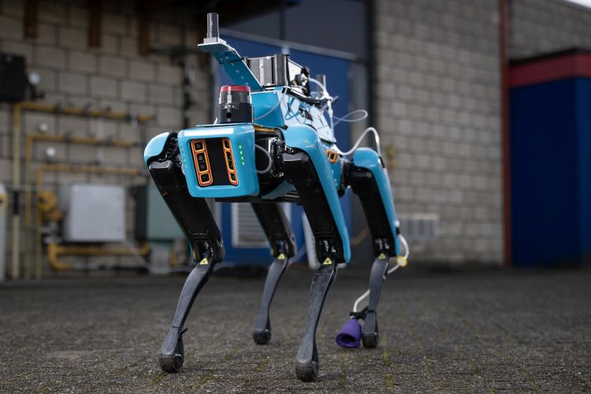
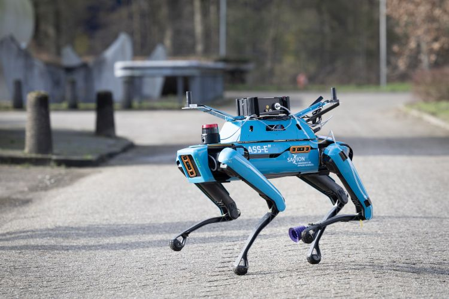

# CHARISMA Backpack

<p align="center" width="100%">
  
    
    <br>
    <em>SPOT backpack being used in the CHARISMA project.</em>
</p>

This repository contains the SolidWorks files and documentation for the SPOT backpack that is used in the CHARISMA project of the Smart Mechatronics And RoboTics (SMART) Research Group of the Saxion University of Applied Sciences. 

# Documentation
  * [Context](/Documentation/01-context.md)
  * [Functional Overview](/Documentation/02-functional-overview.md)
  * [Quality Attributes](/Documentation/03-quality-attributes.md)
  * [Constraints](/Documentation/04-constraints.md)
  * [Requirements](/Documentation/xx-requirements.md)
  * [Principles](/Documentation/05-principles.md)
  * [Implementation](/Documentation/07-Implementation.md)
    * List of Parts 
    * Power Distribution
  * [Instructions](/Documentation/8-instructions.md)
    * [Manufacturing Instructions](/Documentation/8.1-manufacturing-instructions.md)
    * [Assembly Instructions](/Documentation/8.2-assembly-instructions.md)
    * [Mounting Instructions](/Documentation/8.3-mounting-instructions.md)
  * [Development Environment](/Documentation/12-development-environment.md)
  * [Support and Contributions](/Documentation/11-support-and-contributions.md)
  * [Architecture Decision Records](/Documentation/11-decision-log.md)
  * [Suggested Changes](/Documentation/12-Suggested-Changes.md)

# Specifications

| Parameter | Backpack V2.0.0 | 
| --- | --- |
| Weight | 3 kg |
| Dimensions | 20 x 40 x 10.5 cm|
| Material | Aluminium Sheet Metal |
| Voltage Outputs | 5, 12, 24 V (M12 Connectors) |
| Media Connectors | 4x USB 3.0, HDMI, Ethernet |
| On-board PC | VECOW SPC-7000|

# Directory Structure

```md
SPOT Backpack Repository                
├── CAD 
│   ├── 3D Drawings                     # .SLDPRT and .step files used in the assembly
|   |   ├── 3D Print Components
|   |   ├── Sheet Metal Components
|   |   ├── Other Components
│   |   └── Backpack Assembly.SLDASM    # Main assembly
│   └── Production Drawings             # Parts to be produced
|       ├── 3D Print Components         # .3MF files
|       └── Sheet Metal Components      # .step files for SOPHIA
├── Documentation
├── Images
└── Other Files                         
```

<p align="center">
    
    
    <div style="clear:both;"></div>
    <div style="text-align: center;">
        <em>Solidworks assembly of the backpack.</em>
    </div>
</p>

<p align="center" width="100%">
    
    <br>
    <em>SPOT backpack being used in the CHARISMA project.</em>
</p>

## License
This project is released under the [CERN OHL v2 Weakly Reciprocal](https://choosealicense.com/licenses/cern-ohl-w-2.0/) license. Feel free to use, modify, and distribute the hardware designs in accordance with the terms of the license.

## Acknowledgments
This work from the SMART research group at Saxion University of Applied Sciences was supported by the Alliander Research Center for Digital Technologies and TechForFuture.

<p align="center" width="100%">
    
</p>